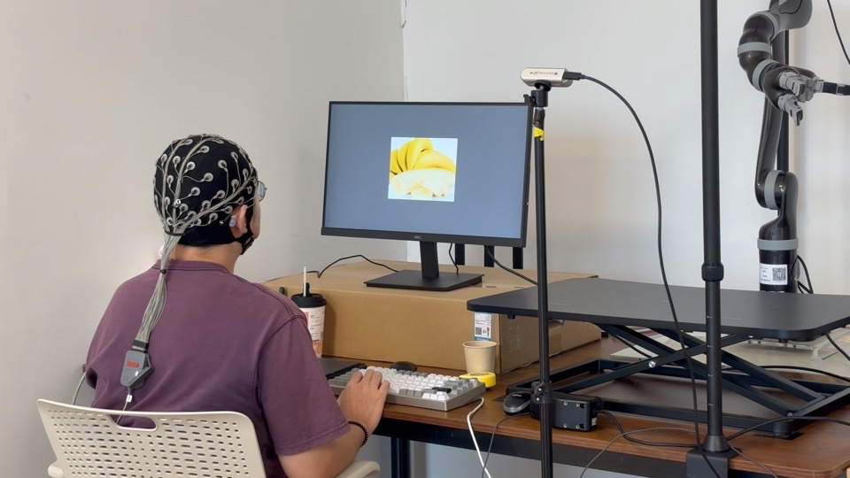
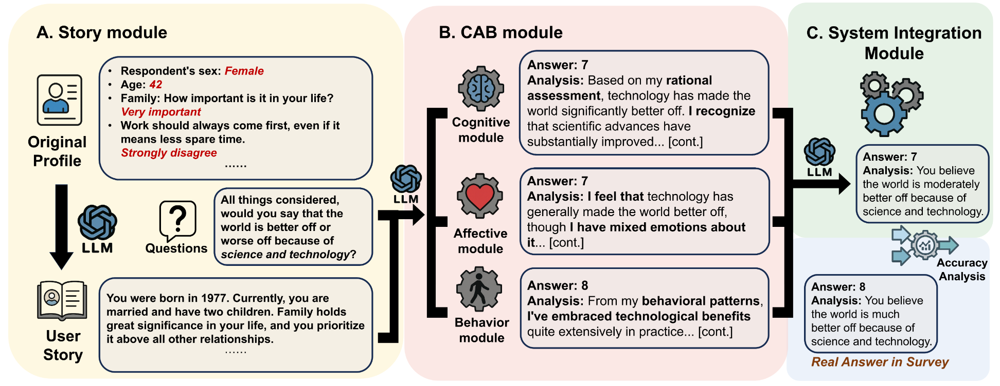
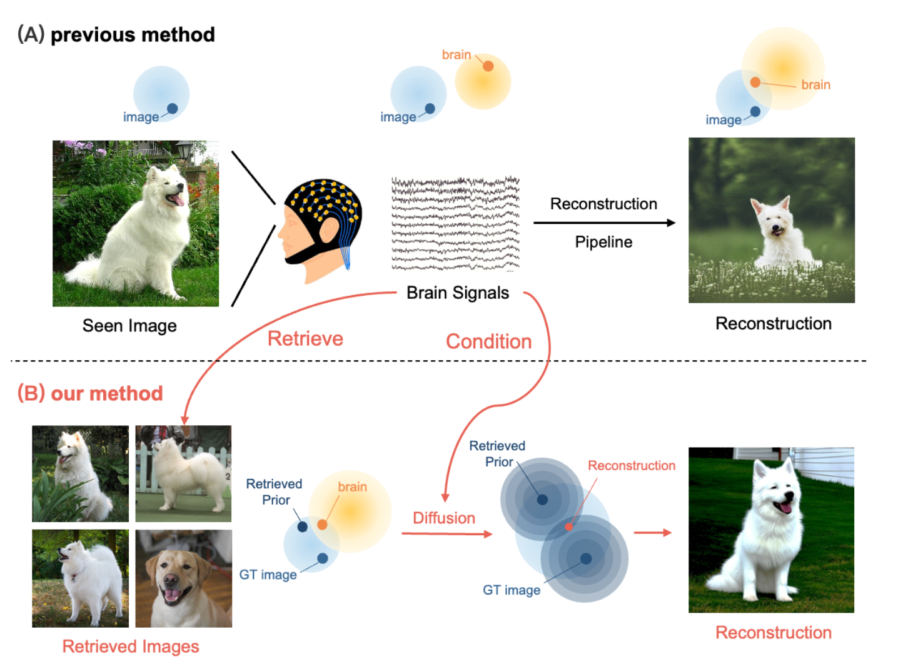
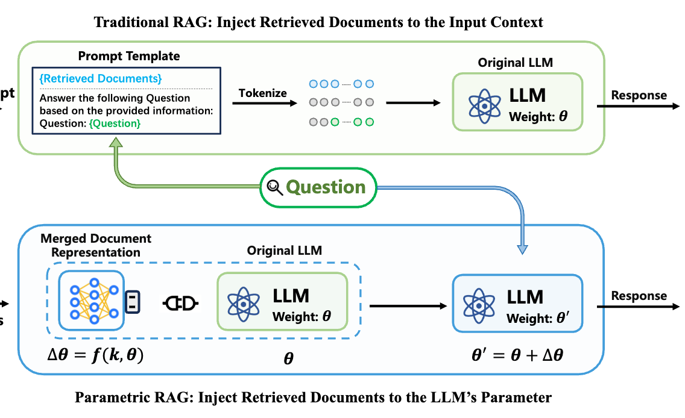
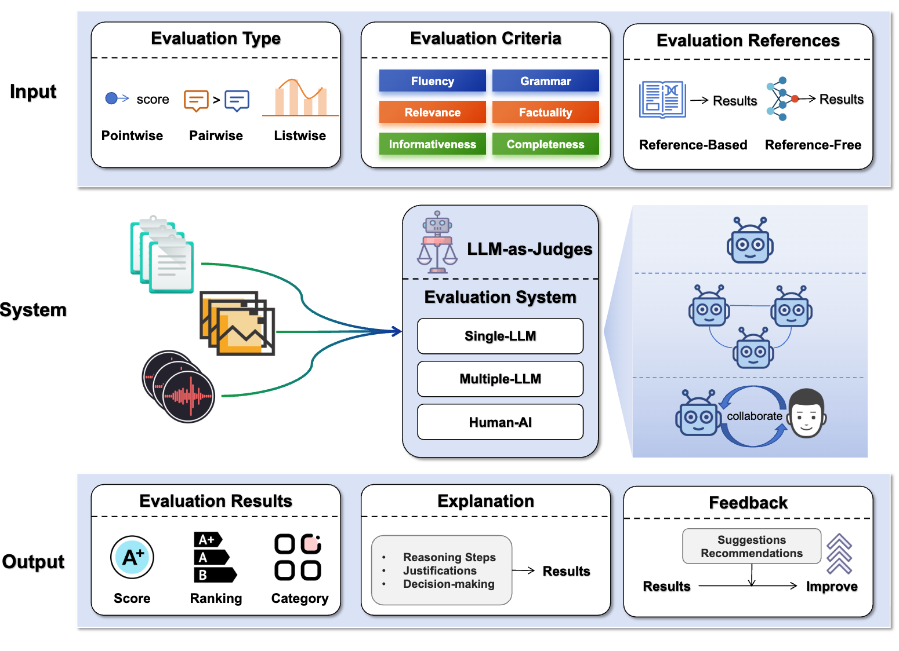
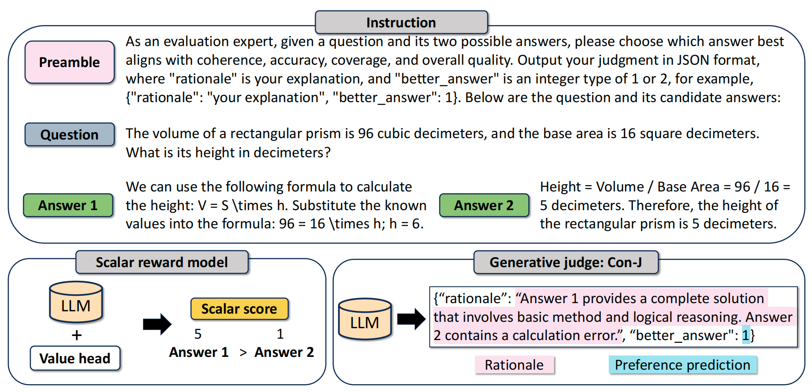
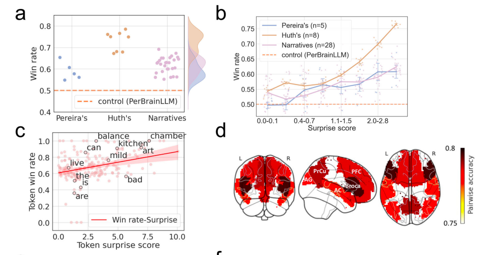








I am an Assistant Professor in [Institute of Trustworthy Embodied AI at Fudan University（复旦大学可信具身智能研究院）](https://teai.fudan.edu.cn/) and a member of [Fudan Vision and Learning Lab（复旦大学视觉与学习实验室，FVL）](https://fvl.fudan.edu.cn/). I received my Ph.D. from [THUIR](http://www.thuir.cn/), [Department of Computer Science and Technology in Tsinghua University](http://www.cs.tsinghua.edu.cn/), Beijing, China.

My major research interests are about multimodel computing, Web search, large language models, and embodied AI. <strong>My goal is to build an intelligent system that can understand human needs, perform human-like behaviors, and interact with humans more effectively.
</strong> My primary areas of interest include:
<ul>
    <li><strong>Multimodal Computing:</strong> Developing models that can understand and integrate diverse sensory inputs (vision, language, touch, human signals, etc.) to perform complex, human-like tasks.</li>
    <li><strong>Human-AI Interaction:</strong> Exploring intuitive and effective ways for autonomous agents to collaborate and communicate with human.</li>
    <li><strong>Cognition of AI:</strong> Investigating how cognitive abilities and complex behaviors emerge in AI system through evolutionary processes.</li>
</ul>

<!-- I have published more than 20 papers at the top international AI conferences . -->

<b>
    I am actively looking for self-motivated students to join my research group. If you are passionate about building the future of AI and Human, please feel free to reach out. 本人依托<a href="https://teai.fudan.edu.cn/" target="_blank" style="color: red;">复旦大学可信具身智能研究院</a>和<a href="https://fvl.fudan.edu.cn/" target="_blank" style="color: red;">复旦大学视觉与学习实验室</a>，正积极招募具有自驱力的学生加入研究团队，诚邀有志于揭示人类智能与机器智能的认知基础、推动人机智能深度协同交互的同学随时沟通（邮箱：zyye@fudan.edu.cn）。
</b>

# 🔥 News

<ul style="list-style-type: none; padding-left: 0; margin: 0;">
<li> 2026.01, our paper titled <b>Robotic Grasping and Placement Controlled by EEG-Based Hybrid Visual and Motor Imagery</b> is accepted by ICRA 2026.</li>
<li> 2026.01, our paper titled <b>SLEEP2VEC: Unified Cross-modal Alignment
for Heterogeneous Nocturnal Biosignals</b> is accepted by ICLR 2026.</li>
<li> 2025.10, I was invited to join the discussion about <b>World Model</b> at CCF YOCSEF. <a href="https://www.ccf.org.cn/YOCSEF/News/2025-10-12/849421.shtml" target="_blank">News</a></li>
<li> 2025.10, I gave an invited talk about <b>AI System Empowered by Neuro Feedback</b> at Computational Neuro-Linguistics Forum.<a href="https://xufengduan.github.io/Computational-Neurolinguistics-Forum/events/2025-10-Ye-Zianyi/">Video</a></li>
<li> 2025.08, I gave an invited talk about <b>"Tips for New Researchers"</b> at NLPCC 2025. <a href="https://yeziyi1998.github.io/files/NLPCC 2025 Ye.en.talk.pdf" target="_blank">Slides</a></li>
<li> 2025.08, our paper titled <b>SimVBG: Simulating Individual Values by Backstory Generation</b> is accepted by EMNLP 2025.</li>
<li> 2025.05, our paper titled <b>EEG reveals the cognitive impact of polarized content in short video scenarios</b> is available in Nature Scientific Reports.</li>
<li> 2025.04, thrilled to announce that I have three co-authered paper accepted by SIGIR 2025, titled <b>Brain Image Reconstruction with Retrieval-Augmented Diffusion</b>, <b>Parametric Retrieval Augmented Generation</b>, and <b>Understanding the Effect of Opinion Polarization in Short Video Browsing</b>.</li>
<li> 2025.04, I will attend ICLR 2025 in person for our paper titled <b>Learning LLM-as-a-Judge for Preference Alignment</b>.</li>
<li> 2025.03, our paper titled <b>Generative Language Reconstruction from Brain Recordings</b> is published in Nature Communications Biology.</li>
<li> 2024.09, our paper titled <b>Pre-trained Model for EEG-based Emotion Recognition</b> won the <b>Best Paper Nomination</b> at CCIR 2024.</li>
<li> 2023.12, I gave an invited talk in the Institute of Information in University of Amsterdam about <b>Language Generation from Brain Recordings</b>. <a href="https://yeziyi1998.github.io/files/Language_Generation_from_Brain_Recordings_240312.pdf" target="_blank">Slide</a></li>
<li> 2023.07, I gave an invited talk to Lenovo Inc about <b>Context-based Brain Decoding</b>. <a href="https://yeziyi1998.github.io/files/Language_Generation_from_Brain_Recordings_240312.pdf" target="_blank">Slide</a>
</li>
<li> 2023.09, I gave an invited talk in Machine Learning Section of Copenhagen University about <b>Brain-Computer Interface for Search</b>. <a href="https://yeziyi1998.github.io/files/BMI4Search_KU_230918.pdf" target="_blank">Slide</a></li>
</ul>

# 📝 Publications

<dl>
  <dt>
    

      
      ICRA 2026
    

  </dt>
  <dd><a href="https://ziyiye.cn/files/ICRA26_3090_MS.pdf"><strong>Robotic Grasping and Placement Controlled by EEG-Based Hybrid Visual and Motor Imagery</strong></a></dd>
  <dd>Yichang Liu, Tianyu Wang, <strong>Ziyi Ye</strong>, Yawei Li, Yanwei Fu, Yu-gang Jiang, Shouyan Wang</dd>
</dl>

<dl>
  <dt>
    

      
      ICLR 2026
    

  </dt>
  <dd><a href="https://openreview.net/pdf?id=DDXhRN66eV"><strong>SLEEP2VEC: Unified Cross-modal Alignment
for Heterogeneous Nocturnal Biosignals</strong></a></dd>
  <dd>Weixuan Yuan, Zengrui Jin, Yichen Wang, Donglin Xie, <strong>Ziyi Ye</strong>, Chao Zhang, Xuesong Chen</dd>
</dl>

<dl>
  <dt>
    

      
      EMNLP 2025
    

  </dt>
  <dd><a href="https://aclanthology.org/2025.emnlp-main.662.pdf"><strong>SimVBG: Simulating Individual Values by Backstory Generation</strong></a></dd>
  <dd>Bangde Du, <strong>Ziyi Ye</strong>, Zhijing Wu, Monika Jankowska, Shuqi Zhu, Qingyao Ai, Yujia Zhou, Yiqun Liu</dd>
</dl>

<dl>
  <dt>
    

      
      SIGIR 2025
    

  </dt>
  <dd><a href="https://dl.acm.org/doi/pdf/10.1145/3726302.3729909"><strong>Brain Image Reconstruction with Retrieval-Augmented Diffusion</strong></a></dd>
  <dd>Shuqi Zhu, <strong>Ziyi Ye</strong>, Yi Zhong, Qingyao Ai, Yujia Zhou, Yiqun Liu</dd>
</dl>

<dl>
  <dt>
    

      
      SIGIR 2025
    

  </dt>
  <dd><a href="https://dl.acm.org/doi/pdf/10.1145/3726302.3729957"><strong>Parametric Retrieval Augmented Generation</strong></a></dd>
  <dd>Weihang Su, Yichen Tang, Qingyao Ai, Junxi Yan, Changyue Wang, Hongning Wang, <strong>Ziyi Ye</strong>, Yujia Zhou, Yiqun Liu</dd>
</dl>

<!-- <dl>
  <dt>
    

      
      Arxiv 2025
    

  </dt>
  <dd><a href="https://arxiv.org/pdf/2412.05579?"><strong>LLMs-as-Judges: A Comprehensive Survey on LLM-based Evaluation Methods</strong></a></dd>
  <dd>Haitao Li, Qian Dong, Junjie Chen, Huixue Su, Yujia Zhou, Qingyao Ai, <strong>Ziyi Ye</strong>, Yiqun Liu</dd>
</dl> -->

<dl>
  <dt>
    

      <video controls preload="metadata" poster="">
        <source src="https://yeziyi1998.github.io/files/output.mp4" type="video/mp4">
        Your browser does not support the video tag.
      </video>
      Dissertation
    

  </dt>

<dd>My Ph.D.'s dissertation: <a href="https://yeziyi1998.github.io/files/thesis.pdf"><strong>Brain Computer Interface for Information Retrieval</strong></a></dd>
  <dd> Relevant papers are published in <a href="https://doi.org/10.1038/s42003-025-07731-7">Nature Commun. Biol. </a>, <a href="http://www.thuir.cn/group/~YQLiu/publications/SIGIR2022Ye.pdf">SIGIR</a>, <a href="https://arxiv.org/abs/2402.15708"> Multimedia </a>, <a href="https://arxiv.org/abs/2312.05669">TOIS</a>, and etc. </dd>
</dl>

<dl>
  <dt>
    

      
      ICLR 2025
    

  </dt>
  <dd><a href="https://openreview.net/forum?id=HZVIQE1MsJ"><strong>Learning LLM-as-a-Judge for Preference Alignment</strong></a></dd>
  <dd><strong>Ziyi Ye</strong>, Xiangsheng Li, Qiuchi Li, Qingyao Ai, Yujia Zhou, Wei Shen, Dong Yan, Yiqun Liu</dd>
</dl>

<dl>
  <dt>
    

      
      Nature Communications Biology
    

  </dt>
  <dd><a href="https://doi.org/10.1038/s42003-025-07731-7"><strong>Generative Language Reconstruction from Brain Recordings</strong></a></dd>
  <dd><strong>Ziyi Ye</strong>, Qingyao Ai, Yiqun Liu, Maarten de Rijke, Min Zhang, Christina Lioma, and Tuukka Ruotsalo</dd>
</dl>

[See my full publication list.](https://scholar.google.com/citations?user=M3Qsb6cAAAAJ&hl=zh-CN)

# 📖 Experience

| Year | Experience |
| :------ | :------ | 
| *08.2025-* | Assistant Professor, Institute of Trustworthy Embodied AI, Fudan University, China. |
| *08.2020-06.2025* | Ph.D. student, Department of Computer Science and Technology, Tsinghua University, China. |
| *11.2023-02.2024* | Guest Ph.D. student, Institute of Informatics, University of Amsterdam, Netherlands. |
| *07.2023-11.2023* | Guest Ph.D. student, Department of Computer Science (DIKU) and the Pioneer Centre for AI, University of Copenhagen, Denmark. |
| *08.2016-07.2020* | B.S. student, Department of Computer Science and Technology, Tsinghua University, China. |

# 📝 Academic Service
- **Journal Reviewer:** *Nature*, *Nature Comm. Bio.*, *Nature Dis. Com.*, *ACM TOIS*, *ACM TKDD*, *ACM TOMM*, *SCIS*

- **Conference Senior PC / PC Member:** *ICLR*, *NeurIPS*, *ICML*, *SIGIR*, *WWW*, *ACM MM*, *CVPR*, *CIKM*, *KDD*, *ACL*, *EMNLP*

 
-**Other Service:** *CCIR Student Contact* (2024.8–2025.8)

# 🎖 Honors and Awards
* 2025, **Ph.D. Dissertation Award of ACM Shanghai**.
* 2025, **Ph.D. Dissertation Award of CIPS**.
* 2025, **Outstanding Graduate of Beijing**.
* 2025, **Qihang Gold Award**, Tsinghua University.
* 2022, **China National Scholarship**, Chinese Government.
* 2017, 2018, 2023, 2024\. Overall Excellence Scholarship, Tsinghua University.
* 2019, Academic Excellence Scholarship, Tsinghua University.
* 2016, **Silver medal in Chinese Mathematical Olympiad(CMO)**, China Mathematical Federation.

# 📚 Teaching Experience
* 2024\. Teaching assistant at GenAI summer school, Tsinghua University. (Instructor of "Retrieval-argumented generation".)
* 2020-2025\. Teaching assistant at "Fundamental Search Engine", Tsinghua University.

# 🏆 Competitions
* We won the 1st place in TASK 2 (Relevant Statue Retrieval Task) of AILA 2019 (Artificial Intelligence for Legal Assisstance). [Working Notes](http://ceur-ws.org/Vol-2517/T1-8.pdf).
* We won the 1st place in the NTCIR-15 Micro-activity Retrieval Task. [Working Notes](http://research.nii.ac.jp/ntcir/workshop/OnlineProceedings15/pdf/ntcir/06-NTCIR15-MART-LiJ.pdf).

# 📊 Datasets

* [EEG-Imagenet Dataset](https://arxiv.org/pdf/2406.07151). In our Paper *EEG-imagenet: An electroencephalogram dataset and benchmarks with image visual stimuli of multi-granularity labels*.

* [EEG-SVC Dataset](https://dl.acm.org/doi/pdf/10.1145/3626772.3657890). In our SIGIR'25 Full paper *EEG-svrec: An eeg dataset with user multidimensional affective engagement labels in short video recommendation*.

* [Search-Brainwave Dataset](http://www.thuir.cn/Search_Brainwave/). In our SIGIR'22 Full Paper *Why Don’t You Click: Understanding Non-Click Results in Web Search with Brain Signals*.

* [UERCM Dataset](https://cloud.tsinghua.edu.cn/d/4ede7ce124cc46f3b42e/?p=%2Fdataset&mode=list). In our The Web Conf’22 Full Paper *Towards a Better Understanding of Human Reading Comprehension with Brain Signals*.

* [TianGong-CRL Dataset](http://www.thuir.cn/TianGong-CRL/). In our ASIST'20 Poster *Investigating COVID-19-Related Query Logs of Chinese Search Engine Users*.
